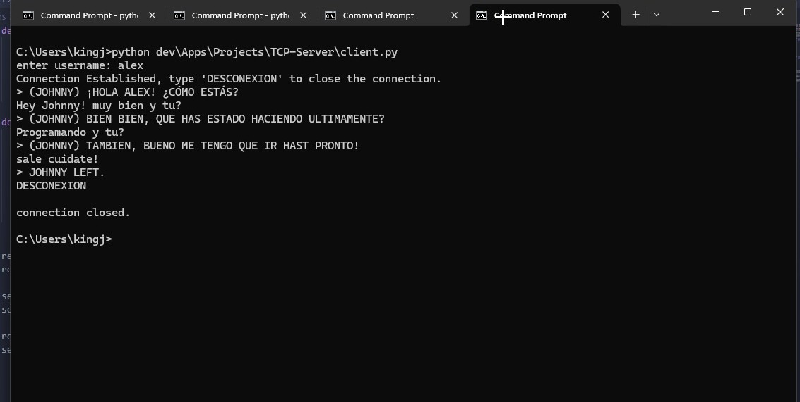

## Vista previa



# Aplicación de Chat (Servidor-Cliente TCP)

Esta es una aplicación de chat simple basada en TCP donde múltiples clientes pueden conectarse a un servidor y comunicarse en tiempo real. El servidor gestiona las conexiones y transmite los mensajes a todos los clientes conectados, excepto al remitente.

## Características
- Soporta múltiples clientes mediante hilos.
- Los clientes pueden unirse y abandonar el chat de manera dinámica.
- Los mensajes se transmiten a todos los clientes conectados.
- Los clientes pueden salir escribiendo `DESCONEXION`.

## Instalación y Configuración

### 1. Clonar el repositorio
```sh
git clone https://github.com/xjohnnygx/TCP-Server
cd TCP-Server


```sh
python -m venv venv
source venv/bin/activate
```

Instalar las dependencias (si las hay, especificadas en requirements.txt):
```sh
pip install -r requirements.txt
```

### 3. Ejecutar el Servidor
```sh
python server.py
```

### 4. Ejecutar los Clientes (Abrir Minimo 2 Terminales)
```sh
python client.py
```
Repite este paso en múltiples ventanas de terminal para tener un chat entre clientes.

## Como funciona
1. El servidor (server.py) escucha las conexiones entrantes.
2. Los clientes (client.py) se conectan e ingresan un nombre de usuario.
3. Los mensajes enviados por un cliente se transmiten a todos los demás clientes.
4. Escribir DESCONEXION en el cliente cerrará la conexión.

## Vista General de Archivos
1. server.py: Ejecuta el servidor TCP y gestiona las conexiones de los clientes.
2. managers.py: Gestiona las conexiones y la transmisión de mensajes.
3. client.py: Se conecta al servidor, envía y recibe mensajes.

## Notas
- Asegúrate de que el servidor esté corriendo antes de iniciar los clientes.
- Usa múltiples ventanas de terminal para simular múltiples usuarios.
- El servidor se ejecuta en localhost:5000 por defecto (cámbialo en el código si es necesario).

## Ejecuta las pruebas de conexion y desconexion del cliente
- Asegurate que server.py este corriendo
- Abre otra 'Tab' e introduce lo sigente
```sh
python test_client.py
```

¡Disfruta chateando!